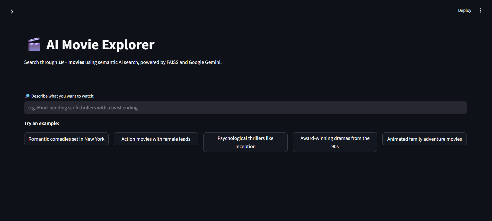
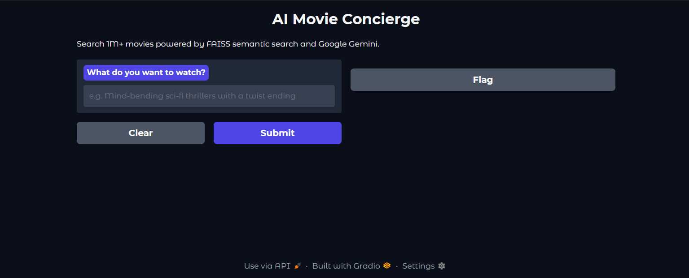

# 🎬 AI Movie Explorer

> A production-ready, RAG-powered movie recommendation system that understands natural language,
> searches 1M+ films semantically, and explains its picks using Google Gemini.

---

## Screenshots

### Streamlit App



The Streamlit interface gives you a persistent sidebar for settings, one-click example queries,
an AI-generated explanation block, and expandable movie cards with full metadata.

---

### Gradio UI (Notebook)



The Gradio interface runs directly inside the notebook. Input your query on the left,
get a formatted AI recommendation on the right. Shareable via a public link with one flag.

---

## Table of Contents

1. [Features](#features)
2. [Project Structure](#project-structure)
3. [Datasets](#datasets)
4. [Installation](#installation)
5. [Credentials Setup](#credentials-setup)
6. [How to Run](#how-to-run)
7. [Notebook Walkthrough](#notebook-walkthrough)
8. [Architecture](#architecture)
9. [Preprocessing Pipeline](#preprocessing-pipeline)
10. [ML Models](#ml-models)
11. [RAG Pipeline](#rag-pipeline)
12. [Streamlit App Reference](#streamlit-app-reference)

---

## Features

| Feature | Details |
|---------|---------|
| 🔍 Semantic search | FAISS `IndexFlatIP` over 384-dim SentenceTransformer embeddings |
| 📊 Hybrid re-ranking | 70% semantic similarity + 20% vote average + 10% popularity |
| 🎯 Diversity filter | Removes franchise duplicates (e.g. no 3 Avengers in a row) |
| 🔎 Query expansion | Short queries like "action" are expanded to richer semantic phrases |
| 🤖 LLM explanations | Google Gemini Flash explains *why* each film matches your request |
| 🎭 Rating prediction | XGBoost regression on vote_average from structured metadata |
| 🎬 Genre classification | Random Forest predicts primary genre |
| 💬 Sentiment analysis | DistilBERT scores 50K IMDB reviews from −1 to +1 |
| 🖥️ Two UIs | Streamlit app (`app.py`) + Gradio inside the notebook |

---

## Project Structure

```
.
├── AI_Movie_Explorer.ipynb    # Research notebook: data → training → RAG → UI
├── app.py                     # Streamlit production app
├── README.md                  # This file
├── screenshot_streamlit.png   # Streamlit UI preview
└── screenshot_gradio.png      # Gradio UI preview
```

---

## Datasets

Both datasets are downloaded automatically at runtime via `kagglehub`. You only need a Kaggle account.

### Big Movie Dataset (1M)
- **Kaggle:** [`shubhamchandra235/imdb-and-tmdb-movie-metadata-big-dataset-1m`](https://www.kaggle.com/datasets/shubhamchandra235/imdb-and-tmdb-movie-metadata-big-dataset-1m)
- **Used for:** ML model training, RAG index, all recommendations
- **Columns used:** `title`, `vote_average`, `vote_count`, `popularity`, `runtime`, `revenue`, `budget`, `release_year`, `genres_list`, `Cast_list`, `Director`, `overview`

### IMDB 50K Reviews
- **Kaggle:** [`lakshmi25npathi/imdb-dataset-of-50k-movie-reviews`](https://www.kaggle.com/datasets/lakshmi25npathi/imdb-dataset-of-50k-movie-reviews)
- **Used for:** Sentiment analysis with DistilBERT
- **Columns used:** `review`, `sentiment`

---

## Installation

### Requirements

- Python 3.9 or higher
- Internet access for first run (dataset download + model weights)
- ~4 GB free disk space (dataset + model weights)
- GPU optional — CPU works fine for inference

### Install all dependencies

```bash
pip install kagglehub pandas numpy scikit-learn xgboost \
            transformers sentence-transformers faiss-cpu \
            torch google-generativeai streamlit gradio
```

> **GPU users:** replace `faiss-cpu` with `faiss-gpu` and install the CUDA-compatible
> version of PyTorch from [pytorch.org](https://pytorch.org/get-started/locally/).

---

## Credentials Setup

You need two sets of credentials. Neither requires payment.

### 1. Kaggle API Key

1. Sign in at [kaggle.com](https://kaggle.com)
2. Go to **Your Profile → Settings → API → Create New Token**
3. A file called `kaggle.json` downloads automatically
4. Place it here:

```
# macOS / Linux
~/.kaggle/kaggle.json

# Windows
C:\Users\YourName\.kaggle\kaggle.json
```

The file looks like this:
```json
{
  "username": "your_kaggle_username",
  "key": "your_kaggle_api_key"
}
```

Make it private on Linux/Mac:
```bash
chmod 600 ~/.kaggle/kaggle.json
```

### 2. Google Gemini API Key

1. Go to [aistudio.google.com](https://aistudio.google.com)
2. Sign in with a Google account
3. Click **Get API Key → Create API key**
4. Copy the key — you will need it when running the app

> The free tier is sufficient for this project.

---

## How to Run

### Option A — Google Colab (recommended for first try)

No local installation required.

1. Upload `AI_Movie_Explorer.ipynb` to [colab.research.google.com](https://colab.research.google.com)
2. Switch runtime to **GPU** (optional but faster): Runtime → Change runtime type → T4 GPU
3. Set secrets — click the 🔑 icon in the left sidebar and add:

| Secret name | Value |
|-------------|-------|
| `GEMINI_API_KEY` | your Gemini key |
| `KAGGLE_USERNAME` | your Kaggle username |
| `KAGGLE_KEY` | your Kaggle API key |

4. Run all cells: **Runtime → Run All**

Expected total runtime on a free T4 GPU: **25–45 minutes**
(most of that is DistilBERT scoring 50K reviews — skip Section 4 if you want faster results)

---

### Option B — Streamlit App (local)

```bash
# 1. Install dependencies
pip install kagglehub pandas numpy scikit-learn xgboost \
            transformers sentence-transformers faiss-cpu \
            torch google-generativeai streamlit

# 2. Set your Gemini API key
export GEMINI_API_KEY=your_key_here       # macOS / Linux
set GEMINI_API_KEY=your_key_here          # Windows CMD
$env:GEMINI_API_KEY="your_key_here"       # Windows PowerShell

# 3. Run
streamlit run app.py
```

Then open **http://localhost:8501** in your browser.

**First run:** downloads dataset + builds FAISS index (~5–10 min).  
**Subsequent runs:** instant — everything is cached by Streamlit.

---

### Option C — Notebook locally (Jupyter)

```bash
pip install jupyter kagglehub pandas numpy scikit-learn xgboost \
            transformers sentence-transformers faiss-cpu \
            torch google-generativeai gradio

jupyter notebook AI_Movie_Explorer.ipynb
```

Run cells in order from Section 0 to Section 7.

---

## Notebook Walkthrough

### Section 0 — Imports and Setup
All third-party imports are consolidated here so the rest of the notebook stays clean.
Nothing to configure.

### Section 1 — Dataset Download
Uses `kagglehub.dataset_download()` to pull both datasets.
Files are cached locally after the first download — re-running this cell is instant.

```
path_big  →  IMDB TMDB Movie Metadata Big Dataset (1M).csv
path_imdb →  IMDB Dataset.csv
```

### Section 2 — Data Cleaning and Feature Engineering
The most important section. All preprocessing runs in a fixed order:

```
Select 12 columns
    ↓
Null handling (all in one pass, before encoding)
    ↓
Parse genres_list and Cast_list from strings to Python lists
    ↓
Drop rows with empty genre lists
    ↓
MultiLabelBinarizer on genres_list (one binary column per genre)
    ↓
LabelEncoder on main_genre and Director
    ↓
MinMaxScaler on numeric features
```

### Section 3 — ML Model Training
Trains two models on the cleaned feature matrix:

- **XGBoost Regressor** → predicts vote_average
- **Random Forest Classifier** → predicts main_genre

Prints MSE, MAE, R², and accuracy after training.

### Section 4 — Sentiment Analysis
Loads DistilBERT and scores all 50K reviews. Each review gets a float in [-1, +1].
This section takes the longest (~20 min on CPU, ~5 min on GPU).
It is independent of the RAG pipeline — you can skip it if you only want recommendations.

### Section 5 — RAG Pipeline
Reloads the movie dataset in its raw form (text fields intact), filters to high-quality films,
builds text documents per movie, embeds them, and indexes them in FAISS.

### Section 6 — Gemini LLM Integration
Chains the FAISS retriever to Gemini. Two test queries run automatically to verify the full pipeline end-to-end.

### Section 7 — Gradio UI
Launches an interactive UI inside the notebook. A public shareable link is printed automatically.

---

## Architecture

```
User query (natural language)
        │
        ▼
  expand_query()
  ─────────────────────────────────────────────────────────
  Short queries enriched with semantic context:
    "action"   → "high intensity action explosions chase combat thriller"
    "romantic" → "love story romance relationship drama heartfelt emotional"
        │
        ▼
  SentenceTransformer  (all-MiniLM-L6-v2)
  ─────────────────────────────────────────────────────────
  Query encoded to 384-dimensional float32 vector
        │
        ▼
  FAISS IndexFlatIP
  ─────────────────────────────────────────────────────────
  Cosine similarity search over ~50K movie vectors
  Returns top-50 candidates
        │
        ▼
  Hybrid re-ranking
  ─────────────────────────────────────────────────────────
  final_score = 0.70 × semantic_similarity
              + 0.20 × (vote_average / 10)
              + 0.10 × (popularity / max_popularity)
        │
        ▼
  Diversity filter
  ─────────────────────────────────────────────────────────
  Removes near-duplicate titles (same franchise root word)
        │
        ▼
  Top-k results
        │
        ▼
  Google Gemini Flash
  ─────────────────────────────────────────────────────────
  Receives movie context + user query
  Generates natural-language explanation
        │
        ▼
  Streamlit / Gradio UI
```

---

## Preprocessing Pipeline

### Why preprocessing is done in this specific order

A common mistake in ML pipelines is encoding data before handling nulls, which causes
`LabelEncoder` to crash on NaN. This notebook handles everything before encoding:

| Step | Operation | Reason |
|------|-----------|--------|
| 1 | `dropna(subset=['overview'])` | Removes rows with no text — useless for RAG |
| 2 | `fillna()` on numeric columns | Medians for year/runtime, 0 for budget/revenue |
| 3 | `fillna('Unknown')` for Director | Must happen before `LabelEncoder` |
| 4 | `safe_parse_list()` on genres/cast | Converts stringified lists to Python lists |
| 5 | Filter `genres_list` length > 0 | Guards against `x[0]` crash on empty list |
| 6 | `MultiLabelBinarizer` on genres_list | One binary column per genre |
| 7 | `LabelEncoder` on main_genre, Director | Numeric labels for tree-based models |
| 8 | `MinMaxScaler` on 6 numeric columns | All features scaled to [0, 1] |

### `safe_parse_list()` — why it exists

The raw CSV stores genres and cast as strings that look like Python lists:
`"['Action', 'Thriller', 'Crime']"`. A naive `ast.literal_eval()` fails on:

- `NaN` values (float, not string)
- Malformed strings like `"['Action'"` (missing closing bracket)
- Already-parsed lists (if pandas auto-converts on read)

`safe_parse_list()` handles all three cases and always returns a clean `list[str]`.

---

## ML Models

### XGBoost Regressor

Predicts `vote_average` (0–10 scale) from structured movie features.

| Parameter | Value |
|-----------|-------|
| `n_estimators` | 200 |
| `learning_rate` | 0.05 |
| `max_depth` | 6 |
| `random_state` | 42 |

**Feature matrix:** scaled numeric columns + genre binary columns + encoded Director.  
**Target:** `vote_average`

### Random Forest Classifier

Predicts primary genre from the same feature matrix.

| Parameter | Value |
|-----------|-------|
| `n_estimators` | 50 |
| `random_state` | 42 |

**Target:** `main_genre_encoded` (label-encoded first genre in genres_list)

---

## RAG Pipeline

### Why the dataset is reloaded in Section 5

The ML pipeline scales all numeric columns to [0, 1] and the raw text fields are no longer
needed for training. The RAG index needs the original unscaled text (overview, genres, cast,
director) to build meaningful embeddings. Reloading keeps the two pipelines cleanly separated.

### Quality filter applied before indexing

Only movies passing all of these conditions are added to the FAISS index:

- `vote_count > 1000` — enough votes to be trustworthy
- `len(overview) >= 80` — enough text for a useful embedding
- Title/overview does not contain: `making`, `soundtrack`, `behind`, `short`, `trailer`, `featurette`, `episode`
- Genre list does not contain `documentary`

### Embedding model

`all-MiniLM-L6-v2` from SentenceTransformers:

- 384-dimensional output vectors
- ~14K sentences/second on CPU
- Strong performance on semantic similarity benchmarks

### Movie document format

Each movie is converted to a single text string before embedding:

```
Genres: Action, Thriller. Director: Christopher Nolan.
Cast: Guy Pearce Carrie-Anne Moss Joe Pantoliano.
Story: A man with short-term memory loss uses notes and tattoos to hunt his wife's killer...
```

This gives the embedder rich multi-field context rather than just the overview alone.

### Hybrid re-ranking formula

```
final_score = 0.70 × cosine_similarity
            + 0.20 × (vote_average / 10)
            + 0.10 × (popularity / max_popularity)
```

Pure semantic search can return obscure films with great plot matches but poor reception.
The rating and popularity weights push well-known, well-reviewed films to the top.

---

## Streamlit App Reference

### Caching strategy

| Resource | Cache decorator | Notes |
|----------|----------------|-------|
| Dataset download + filter | `@st.cache_resource` | Runs once per session |
| FAISS index build | `@st.cache_resource` | Runs once per session |
| Gemini model init | `@st.cache_resource` | Re-runs if API key changes |

### Sidebar controls

| Control | Default | Effect |
|---------|---------|--------|
| Gemini API Key | env var or empty | Enables/disables LLM explanations |
| Number of recommendations | 5 | How many films are returned (3–10) |

### Graceful degradation

If no Gemini API key is provided, the app still works — it shows the matched movies
without AI-generated explanations. A yellow warning banner explains what is missing.

---

